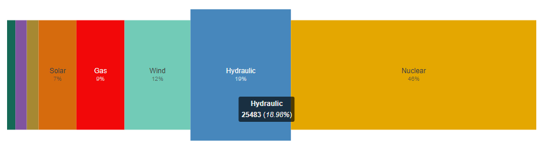

# bar

> Htmlwidgets for [proportions-chart](https://github.com/vasturiano/proportions-chart), mainly to try out [{packer}](https://packer.john-coene.com/#/) to create widgets.

<!-- badges: start -->
[](https://www.tidyverse.org/lifecycle/#experimental)
<!-- badges: end -->


## Installation

You can install the released version of {bar} from GitHub with:

```r
devtools::install_github("dreamRs/bar")
```

## Example

Installed capacities to produce energy in France:



Code:

```r
library(bar)

# Installed capacities by sectors in France (https://www.rte-france.com/eco2mix/les-chiffres-cles-de-lelectricite)
installed <- read.table(
  text = "Bioenergies,2119
          Fuel oil,2892
          Coal,2978
          Solar,9613
          Gas,12196
          Wind,16727
          Hydraulic,25483
          Nuclear,62250",
  col.names = c("sector", "value"),
  header = FALSE, 
  sep = ",",
  stringsAsFactors = FALSE
)
installed$sector <- trimws(installed$sector)
installed

# Visualize data
bar(
  data = installed,
  colors = list(
    "Bioenergies" = "#156956",
    "Fuel oil" = "#80549f",
    "Coal" = "#a68832",
    "Solar" = "#d66b0d",
    "Gas" = "#f20809",
    "Wind" = "#72cbb7",
    "Hydraulic" = "#2672b0",
    "Nuclear" = "#e4a701"
  )
)
```

